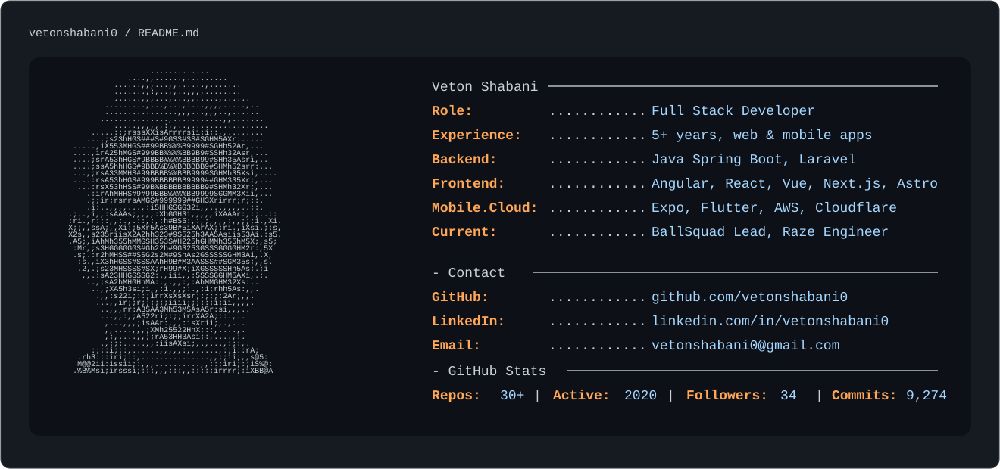

<!--
How to use this as your GitHub profile README:

1. Create a public GitHub repository named exactly like your username.
   For you, that is: vetonshabani0/vetonshabani0

2. Put this README.md plus dark_mode.svg and light_mode.svg in that repo.

3. Edit the SVG text to match your real details, links, languages, and stats.

This repo includes a GitHub Actions workflow that updates repo, active-since,
follower, and contribution counts.

For private repositories or exact all-account stats, add a repository secret
named PROFILE_STATS_TOKEN with read-only access to your repositories. You can
also set repository variables named PROFILE_REPO_COUNT and PROFILE_COMMIT_COUNT
when you want to display a manual total such as private repo counts.
-->
